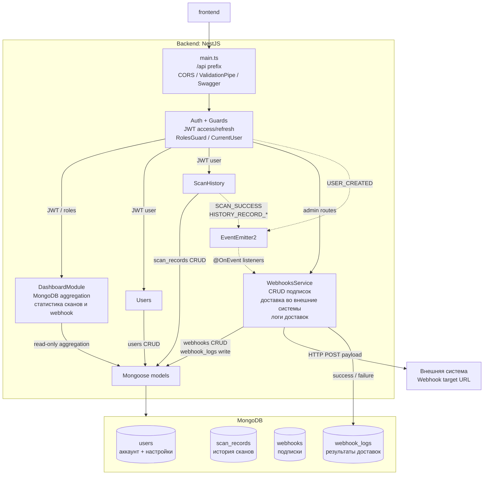

```mermaid
flowchart TB
    Client["frontend"]

    subgraph Backend["Backend: NestJS"]
        API["main.ts<br/>/api prefix<br/>CORS / ValidationPipe / Swagger"]
        Auth["Auth + Guards<br/>JWT access/refresh<br/>RolesGuard / CurrentUser"]
        Events["EventEmitter2"]
        WebhookWorker["WebhooksService<br/>CRUD подписок<br/>доставка во внешние системы<br/>логи доставок"]
        Dashboard["DashboardModule<br/>MongoDB aggregation<br/>статистика сканов и webhook"]
        UserModule["Users"]
        ScanModule["ScanHistory"]
        Mongoose["Mongoose models"]
    end

    subgraph Mongo["MongoDB"]
        Users[("users<br/>аккаунт + настройки")]
        Records[("scan_records<br/>история сканов")]
        Webhooks[("webhooks<br/>подписки")]
        Logs[("webhook_logs<br/>результаты доставок")]
    end

    External["Внешняя система<br/>Webhook target URL"]

    Client --> API
    API --> Auth
    Auth -->|"JWT / roles"| Dashboard
    Auth -->|"JWT user"| UserModule
    Auth -->|"JWT user"| ScanModule
    Auth -->|"admin routes"| WebhookWorker

    UserModule -->|"users CRUD"| Mongoose
    ScanModule -->|"scan_records CRUD"| Mongoose
    WebhookWorker -->|"webhooks CRUD<br/>webhook_logs write"| Mongoose
    Dashboard -->|"read-only aggregation"| Mongoose
    Mongoose --> Mongo

    Auth -. "USER_CREATED" .-> Events
    ScanModule -. "SCAN_SUCCESS<br/>HISTORY_RECORD_*" .-> Events
    Events -. "@OnEvent listeners" .-> WebhookWorker
    WebhookWorker -->|"HTTP POST payload"| External
    WebhookWorker -->|"success / failure"| Logs

```
